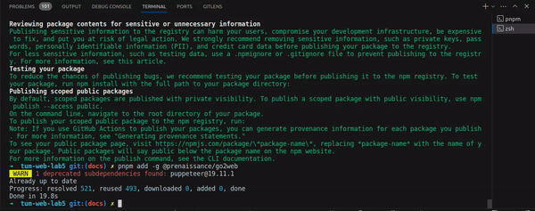
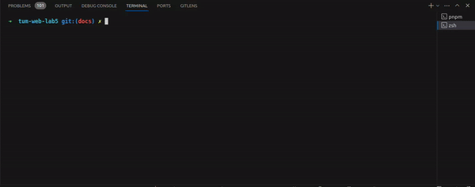

# tum-web-lab5

CLI http client. Install with `npm add -g @prenaissance/go2web` or try with `npx @prenaissance/go2web`.

HTTP 1.1 TLS support inspired from [undici's source code](https://github.com/nodejs/undici/blob/main/lib/core/connect.js)

## Info:

## Usage:

